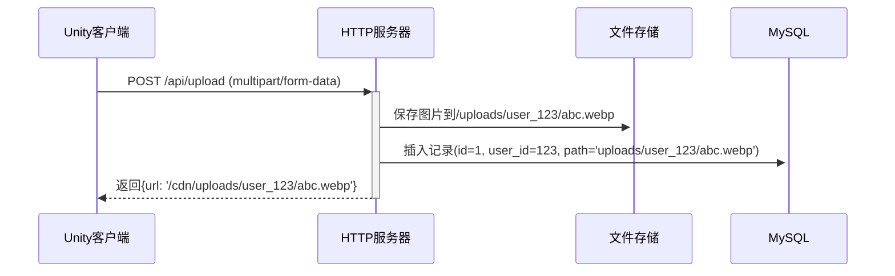
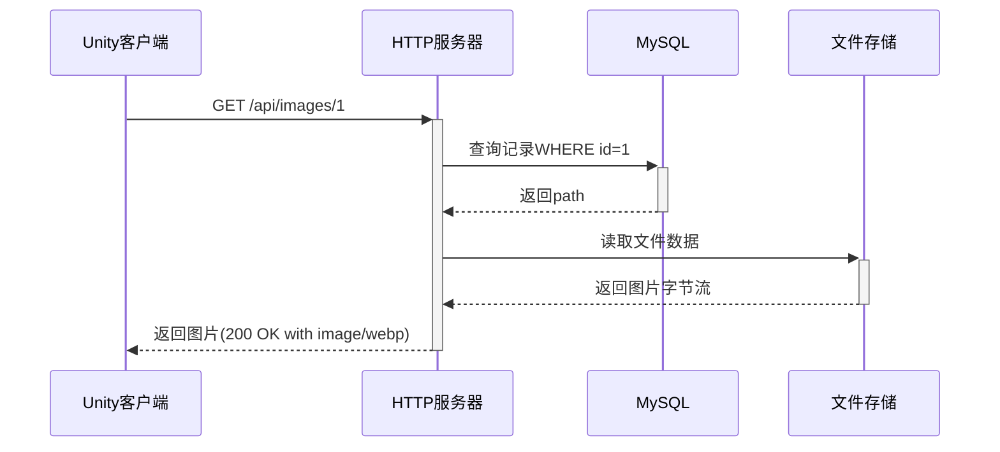

# Unity3D网络游戏实战笔记

- 计划：登录等一系列操作通过HTTP请求操作，进入游戏通过Socket操作

- 目前：一直Socket操作

  

#### 头像上传流程

```mermaid
sequenceDiagram
Unity客户端->>+HTTP服务器: POST /api/upload (multipart/form-data)
HTTP服务器->>+文件存储: 保存图片到/uploads/user_123/abc.webp
HTTP服务器->>+MySQL: 插入记录(id=1, user_id=123, path='uploads/user_123/abc.webp')
HTTP服务器-->>-Unity客户端: 返回{url: '/cdn/uploads/user_123/abc.webp'}
```

#### 头像下载流程

```mermaid
sequenceDiagram
Unity客户端->>+HTTP服务器: GET /api/images/1
HTTP服务器->>+MySQL: 查询记录WHERE id=1
MySQL-->>-HTTP服务器: 返回path
HTTP服务器->>+文件存储: 读取文件数据
文件存储-->>-HTTP服务器: 返回图片字节流
HTTP服务器-->>-Unity客户端: 返回图片(200 OK with image/webp)
```

