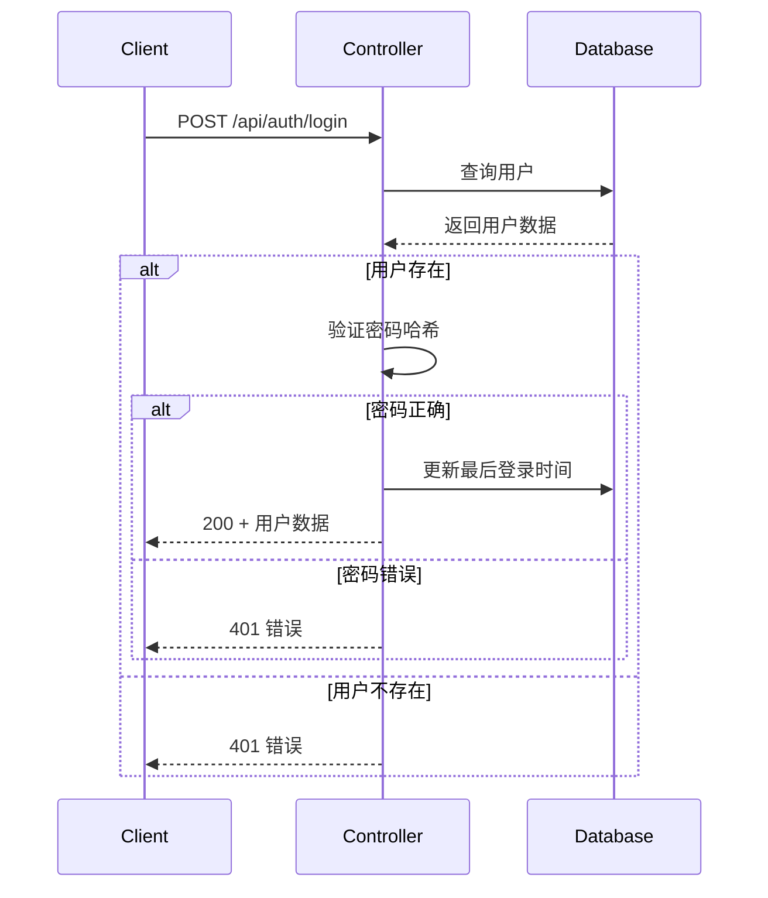
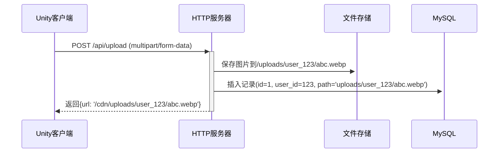
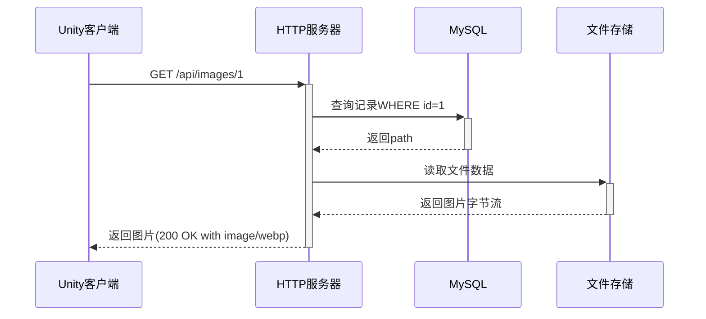

# Unity3D网络游戏实战笔记

- 计划：登录等一系列操作通过HTTP请求操作，进入游戏通过Socket操作
- 目前：一直Socket操作
- 

#### 登录

```mermaid
sequenceDiagram
    participant Client
    participant Controller
    participant Database
    
    Client->>Controller: POST /api/auth/login
    Controller->>Database: 查询用户
    Database-->>Controller: 返回用户数据
    alt 用户存在
        Controller->>Controller: 验证密码哈希
        alt 密码正确
            Controller->>Database: 更新最后登录时间
            Controller-->>Client: 200 + 用户数据
        else 密码错误
            Controller-->>Client: 401 错误
        end
    else 用户不存在
        Controller-->>Client: 401 错误
    end
```

#### 头像上传流程

```mermaid
sequenceDiagram
Unity客户端->>+HTTP服务器: POST /api/upload (multipart/form-data)
HTTP服务器->>+文件存储: 保存图片到/uploads/user_123/abc.webp
HTTP服务器->>+MySQL: 插入记录(id=1, user_id=123, path='uploads/user_123/abc.webp')
HTTP服务器-->>-Unity客户端: 返回{url: '/cdn/uploads/user_123/abc.webp'}
```

#### 头像下载流程

```mermaid
sequenceDiagram
Unity客户端->>+HTTP服务器: GET /api/images/1
HTTP服务器->>+MySQL: 查询记录WHERE id=1
MySQL-->>-HTTP服务器: 返回path
HTTP服务器->>+文件存储: 读取文件数据
文件存储-->>-HTTP服务器: 返回图片字节流
HTTP服务器-->>-Unity客户端: 返回图片(200 OK with image/webp)
```

#### 文件安装

[坦克大战](https://cloud.189.cn/t/v2yU7rjQjuuq（访问码：k1yq）)

